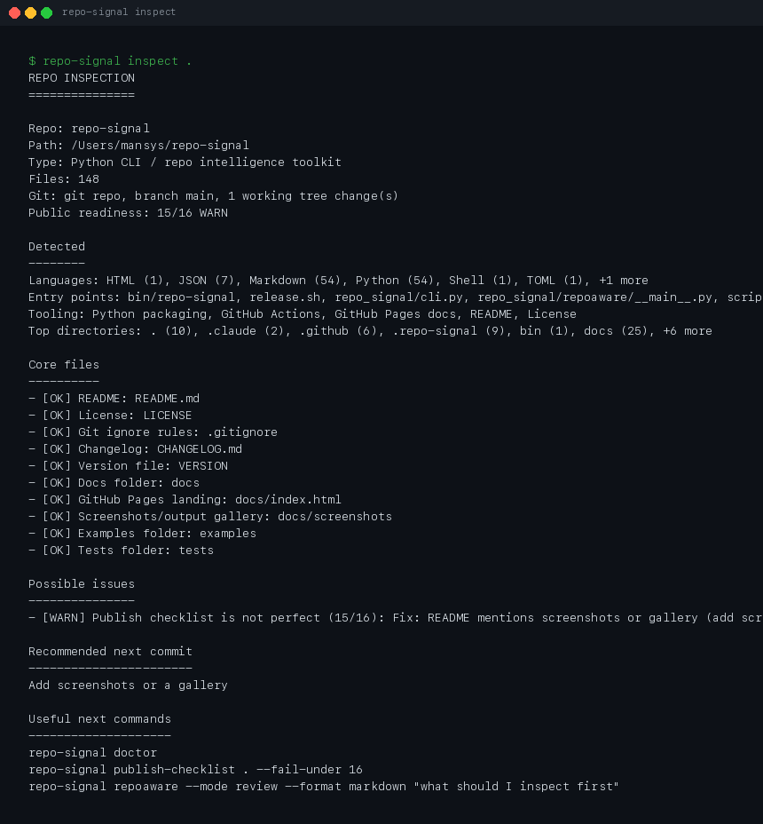
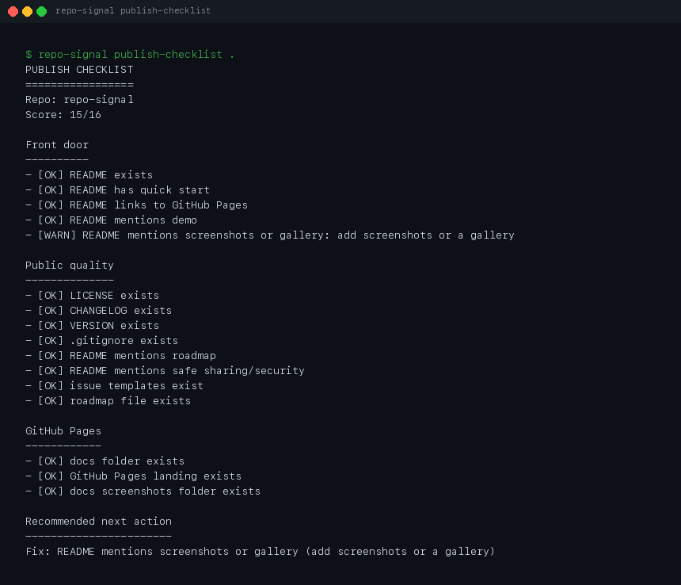
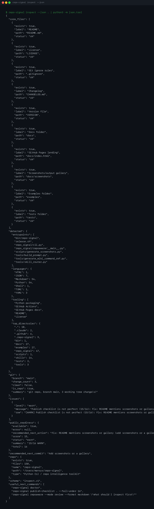

# repo-signal

[](https://github.com/MCamner/repo-signal/actions/workflows/tests.yml)
[](https://github.com/MCamner/repo-signal/actions/workflows/pypi.yml)
[](https://github.com/MCamner/repo-signal/releases)
[](VERSION)

**What problem does this solve?**
You have a local repo — maybe a prototype, a side project, or a tool in progress.
It works, but the README is thin, the docs are missing, the version is out of sync,
and you don't know if it's actually ready to publish. `repo-signal` tells you exactly
what's wrong and what to fix next.

**Who is this for?**
Developers who build small tools and want structured signals for when something is
actually ready. Works standalone or as a backend contract for AI agent workflows.

`repo-signal` turns local repository state into clear analysis reports,
publish-readiness signals, and machine-readable JSON contracts for AI-assisted
development workflows.

## MQ stack architecture

`repo-signal` is part of the MQ stack. It produces repo intelligence and
observations; it does **not** own durable memory. Whole-stack architecture and
the memory loop are documented in mqobsidian (source of truth):
[docs/architecture/mq-stack.md](https://github.com/MCamner/mqobsidian/blob/main/docs/architecture/mq-stack.md).

---

## Install

From PyPI:

```bash
pipx install repo-signal
```

Current local development install:

```bash
git clone https://github.com/MCamner/repo-signal.git
cd repo-signal
python3 -m venv .venv
source .venv/bin/activate
pip install -e ".[ai]"
```

See [PyPI publishing guide](docs/PYPI.md) for the release workflow.

---

## Usage

Use `repo-signal` from the root of any local Git repository. The normal loop is:

```bash
repo-signal analyze              # orient around repo type, stack and focus areas
repo-signal inspect              # fast status and recommended next commit
repo-signal review-export .      # write repo-review.v1 to mqobsidian/reviews
repo-signal doctor               # full repo health, docs, release and AI-readiness check
repo-signal publish-checklist .  # public release-readiness gate
```

For automation, prefer JSON outputs such as `repo-signal inspect --json`,
`repo-signal doctor --json`, and `repo-signal publish-checklist . --format json`.

---

## Try this in 60 seconds

```bash
# Get a high-level overview
repo-signal analyze

# Fast status report and next commit suggestion
repo-signal inspect

# Machine-readable status for integrations
repo-signal inspect --json

# Full readiness diagnosis
repo-signal doctor

# Check public-readiness signals
repo-signal publish-checklist .
```

---

## Command Surface

**Stable commands:**

```text
repo-signal
├── analyze            # Front-door orientation
├── inspect            # Fast status and next commit
├── inspect --json     # Machine-readable inspect.v1 contract
├── doctor             # Full readiness diagnosis
├── publish-checklist  # Public signal quality gate
├── report             # Unified report — inspect + publish-checklist in one
├── report --json      # Machine-readable report.v1 contract
├── suggest            # Safe patch suggestions — read-only, no mutations
├── suggest --json     # Machine-readable suggest.v1 contract
├── repoaware          # AI context export
└── demo               # Generate example reports
```

**Stable JSON contracts:** `inspect.v1` · `doctor.v1` · `report.v1` · `suggest.v1`

See the [Command Reference](docs/COMMANDS.md) and [Roadmap](ROADMAP.md) for full details.

---

## Screenshots







---

## Examples

- [Report (text)](examples/report/report.txt)
- [Report (JSON — report.v1)](examples/report/report.v1.json)
- [Suggest (text)](examples/suggest/suggest.txt)
- [Suggest (JSON — suggest.v1)](examples/suggest/suggest.v1.json)
- [Inspect (text)](examples/inspect/inspect.txt)
- [Inspect (JSON — inspect.v1)](examples/inspect/inspect.v1.json)
- [Doctor (text)](examples/doctor/doctor.txt)
- [Doctor (JSON — doctor.v1)](examples/doctor/doctor.v1.json)
- [Analyze](examples/analyze/analyze.txt)

Generate your own local demo reports:

```bash
repo-signal demo --generate
```

---

## Use with AI agents

`repo-signal` is designed as a backend contract for AI agent workflows.
All stable commands have JSON output that agent tools can consume safely:

```bash
# Check schema before parsing
repo-signal inspect --json . | python3 -c "
import json, sys
d = json.load(sys.stdin)
assert d['schema'] == 'inspect.v1'
print(d['recommended_next_commit'])
"
```

See [Integrations](docs/INTEGRATIONS.md) for mqlaunch, mq-agent, mq-mcp, and mq-hal patterns.

---

## Documentation

Live docs: [mcamner.github.io/repo-signal](https://mcamner.github.io/repo-signal/)

**Contracts:**

- [**Inspect Schema**](docs/INSPECT_SCHEMA.md) — `inspect.v1` field reference
- [**Doctor Schema**](docs/DOCTOR_SCHEMA.md) — `doctor.v1` field reference
- [**Report Schema**](docs/REPORT_SCHEMA.md) — `report.v1` field reference
- [**Suggest Schema**](docs/SUGGEST_SCHEMA.md) — `suggest.v1` field reference, no-mutation guarantee

**Usage:**

- [**Command Reference**](docs/COMMANDS.md) — Detailed CLI usage and flags
- [**Integrations**](docs/INTEGRATIONS.md) — How mqlaunch, mq-mcp, mq-hal, and Bridget consume JSON contracts
- [**RepoAware**](docs/REPOAWARE.md) — High-signal AI context ranking and export
- [**Semantic Memory**](docs/SEMANTIC_MEMORY.md) — Uploading symbol maps to vector stores

**Publishing:**

- [**Packaging**](docs/PACKAGING.md) — PyPI / pipx readiness plan and packaging smoke tests
- [**PyPI**](docs/PYPI.md) — Real PyPI publishing guide and Trusted Publisher values
- [**Generated Examples**](docs/GENERATED_EXAMPLES.md) — How examples are generated and verified before release
- [**Roadmap**](ROADMAP.md) — Release direction and stability checklist

---

## Roadmap

Current focus is keeping the v1.x contracts stable while improving the quality
of repo-aware context for AI tools. Near-term work:

- keep `inspect.v1`, `doctor.v1`, `report.v1`, and `suggest.v1` stable
- exclude generated noise such as backup folders from entrypoint detection
- improve symbol extraction for non-Python repos, especially PowerShell-heavy tools
- keep examples and generated reports current for downstream agents

See [ROADMAP.md](ROADMAP.md) for the full roadmap.

---

## Contributing

Contributions should preserve the stable JSON contracts and keep commands safe
for automation. Before opening a PR, run:

```bash
pytest
repo-signal doctor . --json
repo-signal publish-checklist . --format json
```

When changing CLI output, update the matching docs and examples so agent
integrations keep a reliable contract.

---

## v1.4.0 status

- [x] 4 stable JSON contracts: `inspect.v1`, `doctor.v1`, `report.v1`, `suggest.v1`
- [x] Full test suite passes — `254 passed, 2 skipped`
- [x] Schema checks in `release.sh` for all four stable contracts
- [x] Contract docs: `INSPECT_SCHEMA.md`, `DOCTOR_SCHEMA.md`, `REPORT_SCHEMA.md`, `SUGGEST_SCHEMA.md`
- [x] Generated examples: `examples/report/`, `examples/suggest/`, `examples/inspect/`, `examples/doctor/`
- [x] CLI surface frozen for v1.x

See [CHANGELOG.md](CHANGELOG.md) for full release history.

- [x] GitHub Actions green (Tests, Packaging, Generated examples, Publish checklist)
- [x] `.markdownlint.json` configured

---

## Author

Mattias Camner

Infrastructure / Platform Architect  
Builder of command surfaces, endpoint readiness prototypes, and structured
workflow systems.

---

## License

MIT
